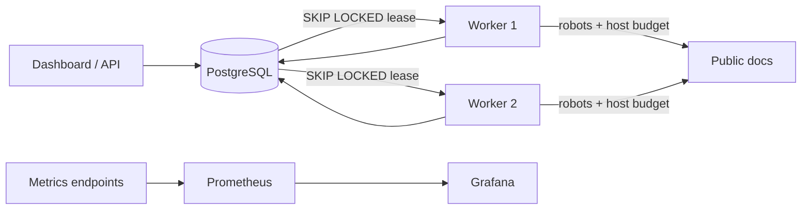

# DocWeave

DocWeave is a policy-aware, distributed documentation crawler written in Go. Multiple stateless workers coordinate through a durable PostgreSQL frontier, enforce host-wide crawl delays, recover expired leases, suppress duplicate URLs, and retain content versions for change detection.

It is intentionally a crawler—not a scraping-evasion toolkit. It honors `robots.txt`, identifies itself, stays inside explicit host boundaries, and rejects private-network targets by default.

## Why it is technically interesting



- **Crash-safe work distribution:** PostgreSQL leases provide at-least-once delivery without an extra queue service. Expired leases become available to another worker.
- **Distributed politeness:** workers transact against a shared `host_limits` table, so adding replicas cannot accidentally multiply request rates.
- **Defensive networking:** DNS and redirect validation mitigate SSRF and DNS rebinding; response size, time, scheme, and port limits bound resource use.
- **Idempotent ingestion:** normalized URL hashes and database constraints suppress duplicate work. Content hashes preserve only distinct versions.
- **Operational visibility:** structured JSON logs, Prometheus metrics, a provisioned Grafana dashboard, readiness checks, and live SSE progress.

## Quick start

Docker is the only prerequisite:

```bash
export DOCWEAVE_API_KEY=local-development
docker compose up --build
```

The API binds to loopback port `18080` by default to avoid the commonly occupied development port `8080`. Override `DOCWEAVE_HTTP_PORT`, `DOCWEAVE_PROMETHEUS_PORT`, or `DOCWEAVE_GRAFANA_PORT` when needed.

Open:

- Dashboard: <http://localhost:18080>
- Grafana: <http://localhost:3000> (`admin` / `docweave`)
- Prometheus: <http://localhost:9090>

Create a crawl from the dashboard or API:

```bash
curl -sS http://localhost:18080/api/v1/crawls \
  -H 'content-type: application/json' \
  -H 'x-api-key: local-development' \
  -d '{
    "seed_urls":["https://go.dev/doc/"],
    "allowed_hosts":["go.dev"],
    "max_depth":2,
    "max_pages":100,
    "crawl_delay_ms":500
  }'
```

Use `GET /api/v1/crawls/{id}/events` for live SSE progress. After content changes, `POST /api/v1/crawls/{id}/recrawl` requeues the same frontier; `/changes` and `/pages/{pageID}/versions` expose distinct versions.

## API

| Method | Path | Purpose |
|---|---|---|
| `POST` | `/api/v1/crawls` | Validate and create a crawl (API key required) |
| `GET` | `/api/v1/crawls` | List recent crawls |
| `GET` | `/api/v1/crawls/{id}` | Crawl status and counters |
| `GET` | `/api/v1/crawls/{id}/events` | Live server-sent events |
| `GET` | `/api/v1/crawls/{id}/pages?q=` | Page list and PostgreSQL full-text search |
| `GET` | `/api/v1/crawls/{id}/changes` | Pages with multiple content versions |
| `GET` | `/api/v1/crawls/{id}/pages/{pageID}/versions` | Version content for comparison |
| `POST` | `/api/v1/crawls/{id}/recrawl` | Requeue a completed crawl (API key required) |

Runtime modes use the same image:

- `DOCWEAVE_ROLE=api`: HTTP API and dashboard.
- `DOCWEAVE_ROLE=worker`: crawler workers plus an internal metrics endpoint.
- `DOCWEAVE_ROLE=all`: zero-cost/demo deployment with API and workers in one process.

See `.env.example` for configuration.

### Port conflicts

If port `18080` is already occupied, choose another host port without editing Compose:

```bash
DOCWEAVE_HTTP_PORT=18081 docker compose up --build
```

The container still listens on its internal port `8080`; only the host-facing URL changes to <http://localhost:18081>.

## Verification and benchmark

```bash
make test
make test-race
make lint
```

For a deterministic 1,000-page benchmark, start the benchmark profile:

```bash
docker compose --profile benchmark up --build -d
```

The benchmark target enables private-network crawling only for this local fixture. Crawl `http://fixture:8081/page/0` with allowed host `fixture`, depth `3`, and 1,000 pages. Record throughput from Prometheus, p50/p95 duration, memory from `docker stats`, and duplicate count. Do not claim numbers until they are measured on named hardware.

The checked-in [benchmark report](docs/BENCHMARKS.md) records a verified 1,000-page run and explains why its single-host throughput is intentionally bounded by the distributed politeness limit.

## Deployment

`render.yaml` deploys the same image in `all` mode with a bounded two-worker pool, API-key-protected writes, approved demo hosts, and managed PostgreSQL. The full multi-process topology remains the Docker Compose deployment.

## Résumé bullets after measurement

- Engineered a distributed Go crawler using PostgreSQL lease-based work queues, processing **[measured pages/sec]** across four workers with automatic crash recovery and duplicate suppression.
- Implemented policy-aware collection with distributed per-host throttling, `robots.txt`, conditional HTTP requests, SSRF defenses, and content-version change detection.
- Shipped a containerized API and live dashboard with Prometheus/Grafana observability, PostgreSQL full-text search, race-tested concurrency, and automated CI.

## License

MIT
